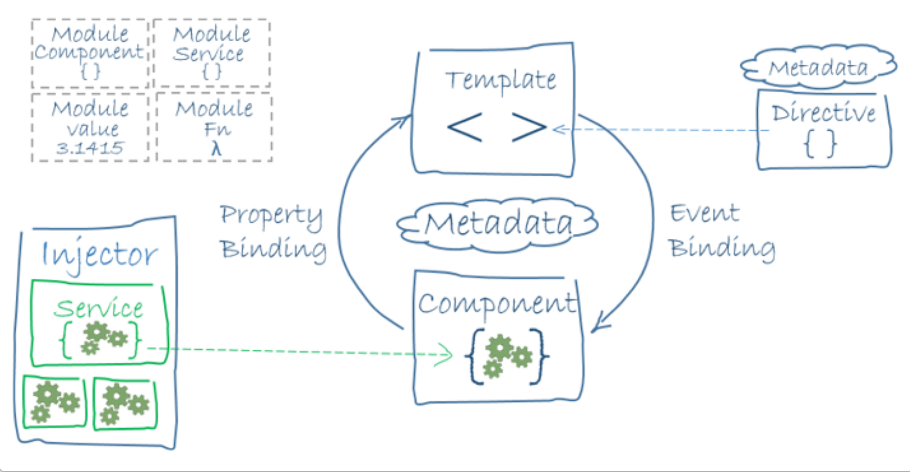

= Theory

=== Angular concepts

Angular is a platform and framework for building single-page client applications using HTML and TypeScript.
It implements core and optional functionality as a set of TypeScript libraries that you import into your applications.

The architecture of an Angular application relies on certain fundamental concepts.
The basic building blocks of the Angular framework are Angular components that are organized into NgModules.
An application always has at least a root module that enables bootstrapping, and typically has many more feature modules.
Modules, components and services are classes that use decorators. These decorators mark their type and provide metadata
that tells Angular how to use them.
An application's components (app.component.html) typically define many views, arranged hierarchically.
Angular provides the Router service to help you define navigation paths among views.
The router provides sophisticated in-browser navigational capabilities.

. Components:
 - Each component has an .html (the view, also called template), a .CSS (format) and  a .ts (code/data).
 - The code is written in the TS and called in the HTML bij "{{ }}".
 - Components define views, which are sets of screen elements that Angular can choose among and modify according to your program logic and data
 - Components use services, which provide specific functionality not directly related to views.

. Services:
 - For data or logic that isn't associated with a specific view, and that you want to share across components,
   you create a service class. A service class definition is immediately preceded by the @Injectable() decorator.
 - it provides 'communication' between several components, api, ...
 - Services providers can be injected into components as dependencies, making your code modular, reusable, and efficient.

    in a component (name.component.ts)
[source,angularjs]
@Component({
selector: 'app-form',
templateUrl: './form.component.html',
styleUrls: ['./form.component.css'],
providers: []
})

    OR in a Module

    [source,angularjs]
    @NgModule({
    declarations: [
    AppComponent,
    FormComponent,
    ],
    imports: [
    BrowserModule,
    FormsModule
    ],
    providers: [],
    bootstrap: [AppComponent]
    })

[start=3]
. Modules: NgModules collect related code into functional sets (services, components,...)

. Decorators: (@Component, @NgModule, ...)
 - decorators mark the type of classes and provide metadata that tells Angular how to use them.
   It gives extra functionality to an existing class.
 - You can use more than 1 decorator for a class

. Metadata:
- The metadata for a service class (given by a decorator) provides the information Angular needs to make it
available to components through dependency injection (DI)

. other elements:
 - directives: can make changes to your html ( *ngForm, *ngIf, ...)
 - pipes (|):are used to convert data
   (for example to filter, convert data to json, ...)
 - ...

=== Template syntax

Each Angular template in your application is a section of HTML to include as a part of the page that the browser displays.
An Angular HTML template renders a view, or user interface, in the browser, just like regular HTML, but with a lot more functionality.

When you generate an Angular application with the Angular CLI, the app.component.html file is the default
template containing placeholder HTML.

The template syntax guides show you how to control the UX/UI by coordinating data between the class and the template.
Almost all HTML syntax is valid template syntax. However, because an Angular template is part of an overall webpage,
and not the entire page, you don't need to include elements such as <html>, <body>, or <base>, and can focus exclusively on the part of the page you are developing.

 - Interpolation: Interpolation refers to embedding expressions into marked up text. By default, interpolation uses the double curly braces {{ and }} as delimiters.
 - Template statements: 	Template statements are methods or properties that you can use in your HTML to respond to user events.
 - Binding syntax: 	Data binding automatically keeps your page up-to-date based on your application's state.
                    You use data binding to specify things such as the source of an image, the state of a button, or data for a particular user
 - Property binding: 	Set properties of target elements or directive @Input() decorators.
 - Attribute, class, and style bindings: 	Set the value of attributes, classes, and styles.
 - Event binding: 	Event binding lets you listen for and respond to user actions such as keystrokes, mouse movements, clicks, and touches
 - Two-way binding: 	Share data between a class and its template.
 - Built-in directives :	Listen to and modify the behavior and layout of HTML.
 - Template reference variables: 	Use special variables to reference a DOM element within a template.
 - Inputs and Outputs: 	Share data between the parent context and child directives or components
 - Template expression operators:	The Angular template expression language employs a
    subset of JavaScript syntax supplemented with a few special operators for specific scenarios
    (the pipe operator (|), The non-null assertion operator (!), The $any() type cast function,...)
 - SVG in templates :	Dynamically generate interactive graphics.

== Key features:
1. input properties (template events):
    -  value property

        in .html:
        <input class="demo value="test"> (plain string in the value property)
        <input class="demo [value]="data.title"> (in this *value property*, we put the value of the value.data expression (from the .ts))

        in .ts:
        export class nameOfClass {
             data = {
             title: 'Angular test'
             };
        }

        in .css: (formatting the file)
            input.demo {
                 border:...
                 width:...
                 ...
            }

    - give name to elements (template reference)

        in .html:
            <input class="demo [value]="data.title" #titleInput>
        Now you can refer to it in all the .html

        in .ts:
            export class nameOfClass {
                data = {
                    title: 'Angular test'
                };
            }

        in .css: (formatting the file)

2. browser events

    - (vb onKeyUp):

        in .html:
        <input class="demo (keyup)= "onKeyUp(titleInput.value)"
                [value]="data.title" #titleInput>
        => Now we refer to the #titleInput (from above)

        in .ts:
             export class nameOfClass {
                 data= {
                    title: 'Angular Test'
                    }
                onKeyUp(newTitle:string){
                    this.data.title = newTitle;
                }
            => now data.title is not 'Angular Test' anymore, but what is typed in the inputbox.

        in .css: (formatting the file)

     - (vb click event):

        in .html:
             

        in .ts:
             export class nameOfClass {
                 onLogoClicked(){
                    alert('Hello World');
                 }
             }
        => an alertbox will show 'Hello World', when the logo is clicked.

        in .css: (formatting the file)

3. automatic synchronisation between data and view:
    If you adapt .ts -, it will be automatically adjusted on the view

4. security features (build in security)

== build a new component

Go to command line, stop the server and put the following command:

 ng generate component nameComponent

=> folder is created with

 .ts :
    import { Component, OnInit } from '@angular/cor';
    import {COURSES} from '../db-data';

    @component({
        selector:'nameComponent',    // defines to which HTML it belongs to  !!! OPM!!!
        templateUrl:'./nameComponent.component.html',    // points to the location in the file system of template file
        styleUrl: ['./nameComponent.component.css']
    }
    export class nameComponent implements OnIt {
            constructor() {}
            ngOnIt(){
            }
    };

 .css (to style this component)

 .html (empty)
you have to add code, f.e. a div

  ......

!! in app.component.html,

  <nameComponent></nameComponent>   !!!OPM!!!
  <nameComponent></nameComponent>
  ...                               // you can add this component as many times as you want
needs te be added

!!! OPM!!! these names should be exactly the same!!!

=== make an array accessible in the project
Make a db-data.ts in de src folder and put an array in it with some objects.

 export const COURSE: any = [
    {
    id=1,
    description: "test"
    ...
    }
    {
    ...
    }
]

You can make this data available in template (.htlm) file by making a variable in the app.component.ts file:

 import { Component } from '@angular/cor';
 import {COURSES} from '../db-data';

 @Component({
 selector:'app-root',
 templateUrl: './app.component.html'.
 styleUrls: [./app.component.css']
 })

 export class AppComponent{
    coreCourse = COURSES [0];
    AngularCourse = COURSE [1];
    ....
    }

now in the html file, you can enter it by

  {{coreCourse.description}}, {{AngularCourse.description}}

OR inside a component we call in the html

  <nameComponent [title]= "AngularCourse.description"></nameComponent>

this element should also be added in the class nameComponentComponent (nameComponent.Component.ts)

  import { Component, OnInit } from '@angular/cor';
  import {COURSES} from '../db-data';

    @component({
        selector:'nameComponent',
// defines to which HTML it belongs to  !!! OPM!!!
        templateUrl:'./nameComponent.component.html',
// points to the location in the file system of template file
        styleUrl: ['./nameComponent.component.css']
    }
    export class nameComponent implements OnIt {
            @Input()                 // by this, Angular knows it is an input property
            title:string;            // of the  <nameComponent></nameComponent> from the html
            constructor() {}
            ngOnIt(){
            }
    };

This way, we can adapt a component, over and over again when you call it in the html.

=== ng For-loop
- NgFor does support arrays and array-like objects as well
- NgFor allows us to loop over data and access each value and index
- NgFor is a structural directive, meaning that it changes the structure of the DOM.
- Its point is to repeat a given HTML template once for each value in an array,
each time passing it the array value as context for string interpolation or binding.

- The syntax is

 *ngFor="let <value> of <collection>".     // *ngFor=let language of languages

<value> is a variable name of your choosing, <collection> is a property on your component which holds a collection,
usually an array but anything that can be iterated over in a for-of loop.

=== Building a template-driven form
https://angular.io/guide/forms

Template-driven forms use two-way data binding to update the data model in the component
as changes are made in the template and vice versa.
Template-driven forms are suitable for small or simple forms, while reactive forms are more scalable and suitable for complex forms

[]
